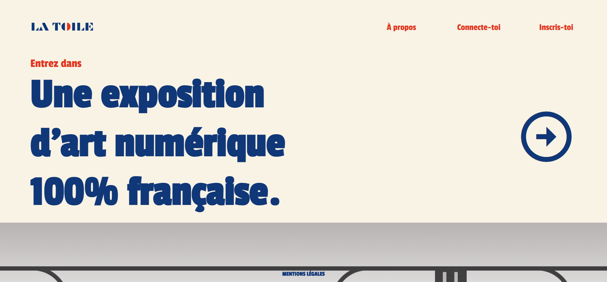

<div align="center">
  <h1 align="center">La Toile</h1>
    <p align="center">
    Our Art Gallery Website, built with Laravel in PHP.
</div>

## About The Project

LaToile is a web application designed to display and manage an art exhibition in a French metro setting. The project was created as part of a university course to practice web development using the Laravel framework.

## Built With

[](https://www.php.net/)  
[](https://laravel.com/)  
[](https://getcomposer.org/)

## Getting Started

### Folder Structure

```markdown
LaToile/
├── 📁 app/               # Application logic
├── 📁 bootstrap/         # Framework bootstrap files
├── 📁 config/             # Configuration files
├── 📁 database/           # Database migrations and factories
├── 📁 lang/               # Language files
├── 📁 public/             # Publicly accessible files
├── 📁 resources/          # Views and assets
├── 📁 routes/             # Route definitions
├── 📁 storage/            # Storage for logs, sessions, etc.
├── 📁 tests/              # Test files
├── 📄 .env.example        # Environment configuration example
├── 📄 .gitignore          # Git ignore file
├── 📄 artisan             # Artisan CLI tool
├── 📄 composer.json       # Composer dependencies
├── 📄 composer.lock       # Composer lock file
└── 📄 README.md           # Project documentation
```

### Prerequisites

Ensure you have the following installed:

```sh
PHP 8+
Composer
Laravel
```

### Installation & Build

1. Clone the repository:

```sh
git clone https://github.com/JulesBobeuf/LaToile.git
cd LaToile
```

2. Install dependencies:

```sh
composer install
```

3. Set up your environment file:

```sh
cp .env.example .env
```

4. Generate the application key:

```sh
php artisan key:generate
```

5. Run database migrations:

```sh
php artisan migrate
```

6. Serve the application:

```sh
php artisan serve
```

### Running the Application

After setting up, navigate to `http://localhost:8000` in your browser to view the application.

## License

This project is licensed under the MIT License. See the [LICENSE](LICENSE) file for details.

## Contact

Jules Bobeuf  
[LinkedIn](https://www.linkedin.com/in/bobeuf-jules/)  
bobeuf.jules@gmail.com
